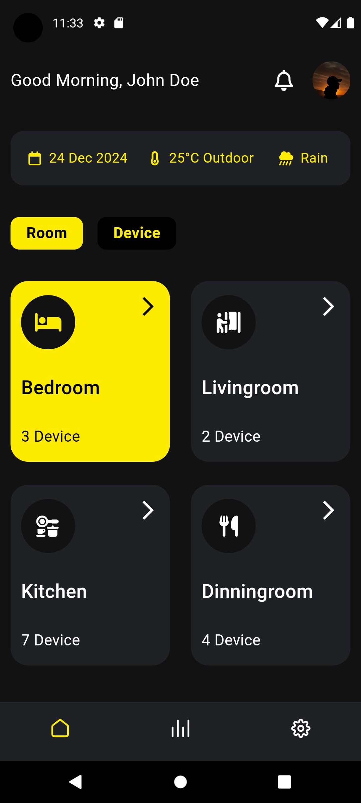
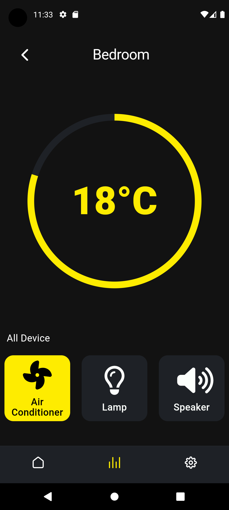

# Home Monitoring Dashboard UI

## Description

This project is a Flutter UI implementation of a Home Monitoring Dashboard. It features a modern and user-friendly interface for monitoring various aspects of your home environment.

## Screenshots

## Installation

To run this project locally, make sure you have Flutter installed. Then, follow these steps:

1. Clone the repository: `git clone https://github.com/yoni-tad/Home-Monitoring-Dashboard.git`
2. Navigate to the project directory: `cd Home-Monitoring-Dashboard`
3. Run `flutter pub get` to install the dependencies.
4. Connect your device or start an emulator.
5. Run the app: `flutter run`

## Features

- Real-time monitoring of home environment metrics.
- Customizable settings for personalization.
- Interactive charts for data analysis.

## Contributing

Contributions are welcome! If you'd like to contribute to this project, please follow these steps:

1. Fork the repository.
2. Create a new branch: `git checkout -b my-new-feature`
3. Make your changes and commit them: `git commit -am 'Add some feature'`
4. Push to the branch: `git push origin my-new-feature`
5. Submit a pull request.

## License

This project is licensed under the [MIT License](LICENSE).

## Contact

For any questions or suggestions, feel free to reach out to me at [yonitad2404@gmail.com](mailto:yonitad2404@gmail.com). You can also find me on [LinkedIn](https://www.linkedin.com/in/yoni-tad/).
